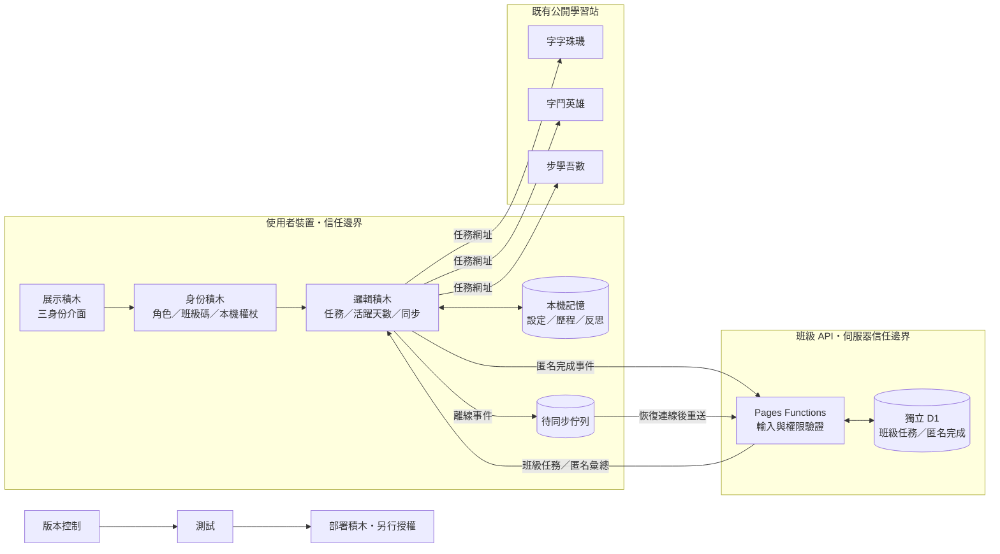

# 自學複利護照設計規格

- 日期：2026-07-27
- 專案：`self-learning-passport`
- 預定路徑：`generated-pages/self-learning-passport`
- 狀態：設計已口頭核准，等待書面規格確認
- 適用版本：A＋B MVP

## 1. 產品目標

「自學複利護照」不是第 28 個獨立學習網站，而是串聯既有遊戲化作品的習慣層。

主要成果是：

> 學生每天能在 5～15 分鐘內完成一個明確的小任務、留下只屬於自己的學習紀錄，並看見一週以上的累積；老師能用匿名班級碼派任務並查看完成統計；家長能在孩子同一裝置上理解本週成長並給予鼓勵。

本版同時服務三種身份，但三者共用同一條核心循環：

`選擇目標 → 接受任務 → 前往學習站 → 自我回報 → 看見累積 → 決定下一步`

## 2. 目標使用者

### 2.1 學生

- 國小高年級至國中學生。
- 需要把國語、英文或數學練習拆成每天可完成的小步驟。
- 不需註冊帳號。
- 完整學習歷程與反思只保存在自己的瀏覽器。

### 2.2 老師

- 想安排跨網站、自主學習或班級短任務的教師。
- 以匿名班級碼建立任務航線。
- 只查看匿名代號、任務完成狀態及班級彙總，不讀取學生反思或題目答案。

### 2.3 家長

- 想了解孩子本週是否持續投入，而不是只看分數的家長。
- 第一版在孩子同一裝置上查看週報。
- 可以設定鼓勵句或下一週節奏，但不能改寫既有完成紀錄。
- 第一版不做跨裝置親子帳號綁定。

## 3. 產品假設與限制

### 3.1 已確認假設

- 使用者選擇的是「操作身份」，不是建立正式帳號。
- 採 A＋B 混合模式：
  - A：個人完整紀錄使用本機保存。
  - B：班級任務與匿名完成統計使用後端保存。
- 第一版不收姓名、Email、學號、班級名稱中的學校資訊或題目作答內容。
- 第一版只串接「字字珠璣」「字鬥英雄」「步學吾數」。
- 跨站完成採學生自我回報，介面不得暗示系統已驗證外部網站的實際作答結果。
- 正式部署與外部資源建立不在本規格自動授權範圍內，需另行確認。

### 3.2 第一版不做

- 正式學生、教師或家長帳號。
- Google、Microsoft 或其他 OAuth 登入。
- 跨裝置同步個人反思。
- 全班成績或排名。
- 遊戲商城、裝備、寵物與抽卡。
- AI 生成任務、AI 評分或 AI 對話。
- Email、LINE、Telegram 或推播提醒。
- 爬取外部學習網站內容。
- 技術驗證跨站作答結果。
- 學校、班級、教師或學生的真實名稱欄位。

## 4. 目前階段與升級門檻

### 4.1 目標產品階段

本 MVP 的目標成熟度是「03 記憶與身份」：

- 展示積木可完成三種身份旅程。
- 身份積木能區分學生、老師、家長及教師管理權。
- 本機與後端記憶能跨時間保存必要狀態。
- 後端權限不依賴前端隱藏按鈕，而由 API 驗證金鑰。

### 4.2 完成門檻

只有以下條件全部成立，才算完成 MVP：

1. 老師可建立班級、安排任務並取得班級碼與教師管理金鑰。
2. 學生可用班級碼取得任務、以匿名代號加入並回報完成。
3. 學生反思只存在本機，API 請求與後端資料皆不包含反思。
4. 老師可查看匿名完成分布，無法查看學生反思或其他個人資料。
5. 家長可在同一裝置查看週報及設定鼓勵句。
6. API 離線時，學生本機完成紀錄不會遺失，班級回報可稍後重送。
7. 核心邏輯、API 權限、隱私不變量、桌機與手機旅程測試通過。

### 4.3 下一階段門檻

只有在小規模試用證明第二週仍有回訪後，才評估：

- 跨站完成碼。
- 匿名通知。
- 跨裝置家長週報。
- 正式身份驗證。
- 更多學習站。

## 5. 技術方案

### 5.1 選定方案

採用原生 HTML、CSS、JavaScript，加上 Cloudflare Pages Functions 與獨立 D1 資料庫。

原因：

- 與現有 `self-learning-orbit` 的靜態前端、Pages Functions、D1 及三平台鏡像模式一致。
- 不需要前端框架或帳號供應商即可完成 A＋B。
- 個人資料仍可本機優先。
- Vercel、Netlify 鏡像可呼叫同一個 Cloudflare API。
- 核心規則可以寫成純函式並直接使用 Node 測試。

### 5.2 已評估但未選用

#### Supabase

適合未來需要 Postgres、RLS、Realtime 或正式帳號的版本，但第一版會引入超過核心旅程所需的能力。

#### Vercel Functions＋Neon

適合 Vercel 單平台產品，但目前作品慣例保留三平台鏡像，使用既有 Cloudflare API 模式較一致。

### 5.3 外部資源邊界

- 規格確認與本機實作階段不建立付費或正式外部資源。
- D1 資料庫、Cloudflare Pages 專案、Vercel 專案與 Netlify 專案都必須在使用者另行授權部署後才建立。
- 所有秘密值只放平台環境變數，不寫入 Git。

## 6. 積木藍圖

| 角色區 | 積木 | 必要性 | 單一職責 | 輸入 → 輸出 | 實作選擇 | 驗收條件 |
|---|---|---|---|---|---|---|
| 入口 | 展示積木 | 必要 | 顯示身份入口、今日任務、學生星圖、老師儀表板與家長週報 | 角色與狀態 → 可操作介面 | HTML／CSS／JavaScript | 響應式、鍵盤可操作、主要行動清楚 |
| 入口 | 排程積木 | 不使用 | 第一版不在背景自動派送或提醒 | 無 | 無 | 專案中無排程依賴 |
| 守門＋調度 | 身份積木 | 必要 | 區分操作角色、班級參與者與教師管理權 | 角色／班級碼／金鑰 → 權限上下文 | 本機角色＋匿名權杖 | API 不接受只有前端聲明的教師權限 |
| 守門＋調度 | 邏輯積木 | 必要 | 派任務、驗證輸入、計算活躍天數、處理同步狀態 | 設定與事件 → 新狀態 | 純函式＋API service | 規則可單元測試，錯誤一致 |
| 工具箱 | 連線積木 | 必要 | 開啟既有學習站並呼叫班級 API | 任務／請求 → 新分頁或 API 結果 | deep link＋`fetch` | timeout、離線與錯誤有 fallback |
| 工具箱 | 記憶積木 | 必要 | 保存個人完整紀錄與匿名班級彙總 | 狀態事件 → 可恢復狀態 | `localStorage`＋D1 | schema、保留期限、刪除與遷移經測試 |
| 工具箱 | AI 積木 | 不使用 | 第一版任務由確定性規則產生 | 無 | 無 | 專案不需要模型金鑰 |
| 工具箱 | 爬蟲積木 | 不使用 | 不抓取外部網站資料 | 無 | 無 | 無爬蟲程式 |
| 工具箱 | 通知積木 | 延後 | 後續才考慮提醒 | 無 | 無 | 第一版不主動傳訊 |
| 工具箱 | 檔案積木 | 延後 | 後續才考慮匯出週報 | 無 | 無 | 第一版不接受上傳 |
| 地基 | 版本控制積木 | 必要 | 保存、測試、協作與回溯 | 程式與文件 → 可追蹤版本 | Git／GitHub public repo | README、忽略機密、測試可重跑 |
| 地基 | 部署積木 | 延後 | 正式發布、健康檢查與回滾 | 已驗證 commit → 正式站 | Cloudflare／Vercel／Netlify | 取得部署授權後才執行 |

## 7. 積木連線圖



## 8. 核心使用者旅程

### 8.1 學生自主旅程

1. 使用者選擇「我是學生」。
2. 若尚未設定，選擇主要領域與每天 5、10 或 15 分鐘。
3. 邏輯積木從三站任務目錄挑出今天的一個任務。
4. 學生按「前往練習」，網站以新分頁開啟既有學習站。
5. 學生回到護照，選擇：
   - 我完成了。
   - 我只完成一部分。
   - 今天先跳過。
6. 完成或部分完成時，可寫最多 200 字的本機反思。
7. 本機星圖、活躍天數、投入分鐘數及週報更新。
8. 若學生已加入班級，完成事件匿名送往班級 API；失敗則進入待同步佇列。

### 8.2 老師班級旅程

1. 使用者選擇「我是老師」。
2. 老師輸入不含學校或班級真名的顯示標題，例如「暑假七日任務」。
3. 老師從三站任務目錄選擇 1～14 個任務並設定順序。
4. API 建立班級，回傳：
   - 六碼班級碼。
   - 只顯示一次的教師管理金鑰。
   - 到期日。
5. 教師管理金鑰保存在老師裝置，也可下載純文字備份。
6. 老師分享班級碼。
7. 老師用本機金鑰查看匿名代號的完成矩陣及彙總。
8. 老師可以修改尚未開始的任務、提前結束或刪除班級。

### 8.3 學生加入班級

1. 學生輸入六碼班級碼。
2. API 回傳班級任務與到期日。
3. 學生確認加入後，API 產生匿名代號與參與者權杖。
4. 匿名代號使用中性「星體＋數字」格式，例如「青鳥 27」，不要求輸入真名。
5. 參與者權杖只存在學生裝置。
6. 學生完成班級任務時，以權杖回報該任務狀態。

### 8.4 家長旅程

1. 使用者在孩子同一裝置選擇「我是家長」。
2. 展示積木從本機記憶產生七日週報：
   - 活躍天數。
   - 完成與部分完成數。
   - 投入分鐘數。
   - 學習領域分布。
   - 孩子願意公開給家長看的本機反思。
3. 家長可選擇一則鼓勵句，顯示在學生下一次首頁。
4. 家長不能更改完成紀錄或班級回報。

## 9. 任務目錄

第一版任務使用靜態資料，不從外站抓取。

每筆任務包含：

```js
{
  id: "zizi-daily-basics",
  siteId: "zizizhuji",
  title: "字音字形每日練習",
  subject: "國語文",
  durationMinutes: 10,
  stage: "國小高年級～國中",
  url: "https://zizizhuji.pages.dev/",
  completionPrompt: "今天最容易混淆的是哪一個字？"
}
```

任務目錄第一版只允許以下正式網域：

- `https://zizizhuji.pages.dev/`
- `https://vocab-duel.pages.dev/`
- `https://bxws-math.pages.dev/`

外部網址必須由靜態白名單提供，不接受教師輸入任意 URL。

## 10. 本機資料契約

儲存鍵：

```text
self-learning-passport:v1
```

資料形狀：

```js
{
  schemaVersion: 1,
  activeRole: "student" | "teacher" | "parent",
  student: {
    participantId: "local random id",
    primarySubject: "language" | "english" | "math",
    dailyMinutes: 5 | 10 | 15,
    activeDays: ["2026-07-27"],
    missionHistory: {
      "2026-07-27": {
        missionId: "zizi-daily-basics",
        status: "complete" | "partial" | "skipped",
        minutes: 10,
        reflection: "只存在本機",
        updatedAt: "ISO timestamp"
      }
    },
    encouragement: {
      message: "我看到你有持續回來。",
      updatedAt: "ISO timestamp"
    }
  },
  classes: {
    "ABC123": {
      participantAlias: "青鳥 27",
      participantToken: "local secret",
      joinedAt: "ISO timestamp",
      expiresAt: "ISO timestamp"
    }
  },
  teacher: {
    managedClasses: {
      "ABC123": {
        teacherKey: "local secret",
        expiresAt: "ISO timestamp"
      }
    }
  },
  syncQueue: []
}
```

規則：

- 載入時驗證 schema，壞資料不可讓整站崩潰。
- 遷移失敗時保留原始備份，改用空白安全狀態並提示使用者。
- `syncQueue` 最多保存 100 筆，依事件識別碼去重。
- 個人反思永不放入 `syncQueue`。
- 提供「清除我的本機資料」。

## 11. 後端資料契約

### 11.1 資料表

#### `classes`

- `id`
- `code`：六碼，不使用易混淆字元。
- `title`：1～40 字，不得包含 Email 或網址。
- `teacher_key_hash`
- `status`：`active`、`closed`、`deleted`
- `created_at`
- `expires_at`：建立後 1～90 天。

#### `missions`

- `id`
- `class_id`
- `catalog_mission_id`
- `position`
- `available_on`
- `created_at`

#### `participants`

- `id`
- `class_id`
- `alias`
- `participant_token_hash`
- `joined_at`
- `last_seen_at`

不保存姓名、Email、學號或 IP。

#### `completions`

- `id`
- `event_id`：客戶端隨機識別碼，用於冪等。
- `class_id`
- `participant_id`
- `mission_id`
- `status`：`complete` 或 `partial`
- `completed_at`
- `created_at`

不保存反思、答案、分數或分鐘數。

### 11.2 保留期限

- 班級建立時選擇 7、30 或 90 天。
- 到期後 API 不再接受完成回報。
- 到期資料可保留 7 天作為刪除緩衝，再由明確的清理程序刪除。
- MVP 尚未加入排程積木時，清理可由受保護的管理指令手動執行；正式上線前若要自動清理，必須另行加入排程積木與冪等測試。

## 12. API 契約

所有回應使用 JSON：

```js
{
  ok: true,
  data: {}
}
```

錯誤格式：

```js
{
  ok: false,
  error: {
    code: "INVALID_CLASS_CODE",
    message: "找不到這個班級碼。"
  }
}
```

### 12.1 `POST /api/classes`

用途：建立匿名班級。

輸入：

```js
{
  title: "暑假七日任務",
  missionIds: ["zizi-daily-basics", "vocab-daily-words"],
  retentionDays: 30
}
```

輸出：

```js
{
  classCode: "ABC123",
  teacherKey: "只回傳一次的隨機金鑰",
  expiresAt: "ISO timestamp"
}
```

限制：

- 每班最多 14 個任務。
- 班級碼碰撞時重新產生，不覆寫既有班級。
- 教師金鑰只儲存安全雜湊。

### 12.2 `GET /api/classes/:code`

用途：學生取得可公開的班級任務。

輸出不包含教師金鑰、參與者清單或完成統計。

### 12.3 `POST /api/classes/:code/join`

用途：建立匿名參與者。

輸入：

```js
{
  participantId: "學生裝置產生的隨機識別碼"
}
```

輸出：

```js
{
  alias: "青鳥 27",
  participantToken: "只回傳一次的參與者權杖",
  expiresAt: "ISO timestamp"
}
```

限制：

- 同一班最多 100 個參與者。
- 參與者權杖只儲存安全雜湊。

### 12.4 `POST /api/classes/:code/completions`

用途：匿名回報完成事件。

授權：

```text
Authorization: Bearer <participantToken>
```

輸入：

```js
{
  eventId: "random id",
  missionId: "mission id",
  status: "complete" | "partial",
  completedAt: "ISO timestamp"
}
```

規則：

- `eventId` 重送時回傳原成功結果，不重複計數。
- 參與者只能回報自己班級內的任務。
- 到期或關閉班級拒絕新事件。
- 請求內若出現反思、答案或姓名欄位，直接拒絕。

### 12.5 `GET /api/classes/:code/summary`

用途：老師查看匿名彙總。

授權：

```text
Authorization: Bearer <teacherKey>
```

輸出：

```js
{
  classCode: "ABC123",
  title: "暑假七日任務",
  expiresAt: "ISO timestamp",
  participants: [
    {
      alias: "青鳥 27",
      completedMissionIds: ["mission-1"],
      partialMissionIds: []
    }
  ],
  totals: {
    participants: 1,
    completedEvents: 1,
    partialEvents: 0
  }
}
```

### 12.6 `PATCH /api/classes/:code`

用途：老師修改班級標題、任務順序或提前關閉班級。

授權：教師管理金鑰。

規則：

- 已有完成紀錄的任務不可刪除，只能停止後續顯示。
- 到期日不可延長超過建立日起 90 天。

### 12.7 `DELETE /api/classes/:code`

用途：老師提前刪除班級資料。

授權：教師管理金鑰。

輸出成功後，該班級碼立即失效。

## 13. 權限與隱私規則

### 13.1 身份不等於授權

- 選擇「我是老師」只切換介面，不會取得任何班級管理權。
- API 只接受有效教師管理金鑰執行管理操作。
- 選擇「我是學生」或「我是家長」同樣不改變伺服器權限。

### 13.2 金鑰處理

- 教師與參與者金鑰使用加密安全的隨機值。
- 後端只保存雜湊。
- 金鑰不出現在 URL、log、分析事件或錯誤訊息。
- 介面只在建立時顯示完整教師金鑰，並提供下載備份。
- 遺失金鑰無法復原，使用者只能建立新班級。

### 13.3 跨來源

- 正式 API 只允許核准的正式站、預覽站及本機開發來源。
- 不使用萬用 `Access-Control-Allow-Origin: *` 搭配敏感授權標頭。
- API 不信任前端傳來的角色或 alias。

### 13.4 個資最小化

- 不建立自由輸入的學生姓名欄位。
- 班級標題偵測到 Email 或網址格式時拒絕。
- API log 不記錄授權標頭與完整請求 body。
- 家長週報完全由本機資料生成。

## 14. 錯誤、離線與回復

### 14.1 外部學習站無法開啟

- 護照顯示「這一站暫時無法開啟」。
- 保留今天的任務，不自動標記完成。
- 提供返回與稍後再試，不靜默改派其他任務。

### 14.2 班級 API 離線

- 學生本機完成紀錄照常保存。
- 匿名班級事件進入 `syncQueue`。
- 先於 5 秒、30 秒、5 分鐘後重試；之後等待下次開站或 `online` 事件。
- 每個事件使用 `eventId` 保證重送不重複計數。
- 介面明確顯示「個人紀錄已保存，班級回報待同步」。

### 14.3 班級碼不存在或到期

- 顯示單一、可理解的錯誤。
- 不自動建立新班級。
- 已在本機完成的個人任務不受影響。

### 14.4 本機儲存不可用

- 顯示隱私模式或瀏覽器限制提示。
- 允許使用當次工作階段，但明確說明關閉分頁後紀錄會消失。
- 不以班級後端取代個人本機歷程。

### 14.5 教師金鑰錯誤

- 回傳一致的未授權錯誤。
- 不透露班級是否由另一位老師管理。
- 連續失敗時由平台層限制請求頻率。

## 15. 介面與視覺方向

### 15.1 視覺概念

主題為「星圖＋紙本護照」：

- 深藍夜空表示長期旅程。
- 米白紙張與印章表示每天留下可回看的足跡。
- 完成任務長出星點，七個活躍日可形成星座。
- 不使用倒數壓力、紅色警告連續登入或失敗羞辱。

### 15.2 主要畫面

1. 身份選擇：學生、老師、家長三張清楚卡片。
2. 學生首頁：「今天一小步」、任務卡、前往練習。
3. 完成回報：完成／部分完成／跳過與本機反思。
4. 學生星圖：本週活躍日、投入時間、領域分布。
5. 班級加入：班級碼與匿名代號確認。
6. 老師建班：選任務、排序、保存期限。
7. 老師儀表板：匿名完成矩陣、彙總與管理。
8. 家長週報：本週節奏、孩子願意分享的反思、鼓勵句。
9. 設定：切換角色、匯出本機資料、清除本機資料。

### 15.3 響應式與無障礙

- 從 360px 寬手機開始設計。
- 所有主要控制至少 44×44px。
- 不靠顏色單獨傳達完成狀態。
- 使用語意化 heading、button、form、status 與 progressbar。
- 鍵盤可完成三種身份核心旅程。
- 對話框管理焦點並支援 Escape。
- 支援 `prefers-reduced-motion`。
- 星圖動畫關閉後仍完整呈現資訊。
- 字級不低於 16px 的主要閱讀文字，避免 iOS 自動縮放。

## 16. 檔案與積木對應

預定結構：

```text
self-learning-passport/
├── index.html
├── styles.css
├── src/
│   ├── app.js
│   ├── data/
│   │   └── mission-catalog.js
│   ├── domain/
│   │   ├── mission-engine.js
│   │   ├── progress.js
│   │   ├── roles.js
│   │   └── sync-queue.js
│   ├── storage/
│   │   └── local-store.js
│   ├── api/
│   │   └── class-client.js
│   └── ui/
│       ├── router.js
│       ├── student-view.js
│       ├── teacher-view.js
│       └── parent-view.js
├── functions/
│   ├── _middleware.js
│   ├── api/
│   │   └── classes/
│   │       ├── index.js
│   │       └── [code]/
│   │           ├── index.js
│   │           ├── join.js
│   │           ├── completions.js
│   │           └── summary.js
│   └── lib/
│       ├── auth.js
│       ├── db.js
│       ├── responses.js
│       └── validation.js
├── migrations/
│   └── 0001_initial.sql
├── test/
│   ├── domain/
│   ├── api/
│   └── static/
├── docs/
│   └── superpowers/specs/
├── package.json
├── README.md
├── wrangler.toml
└── .gitignore
```

責任邊界：

- `ui/` 不直接讀寫 D1 或授權金鑰。
- `domain/` 不存取 DOM、網路或 localStorage。
- `storage/` 只處理本機 schema、遷移與復原。
- `api/` 只負責 HTTP 呼叫與錯誤轉譯。
- `functions/` 在伺服器端驗證授權、輸入與 D1 存取。

## 17. 測試策略

### 17.1 純邏輯測試

- 每日任務選擇不在同一天重複派發。
- 5／10／15 分鐘設定只選相容任務。
- 活躍日與週報計算以台灣日期為準。
- `skipped` 不算完成，也不清空既有成果。
- 家長鼓勵不改變任務完成狀態。
- sync queue 依 `eventId` 去重並限制 100 筆。

### 17.2 本機記憶測試

- schema v1 可保存與載入。
- 壞 JSON、錯誤型別與舊版本資料有安全 fallback。
- 個人反思不會出現在任何 API payload。
- 清除本機資料後所有角色資料移除。

### 17.3 API 測試

- 建班、讀取、加入、完成、摘要、修改與刪除的 happy path。
- 錯誤教師金鑰與參與者權杖回傳 401／403。
- 學生不能讀取摘要。
- 參與者不能回報其他班級任務。
- 重送相同 `eventId` 不重複計數。
- 到期、關閉、刪除班級拒絕新完成事件。
- 任意 URL、過長標題、超過任務與參與者上限被拒絕。
- 包含反思、答案、姓名等禁止欄位的完成 payload 被拒絕。

### 17.4 瀏覽器旅程

- 學生獨立任務流程。
- 老師建班與查看匿名摘要。
- 學生加入班級、離線完成、恢復後同步。
- 家長讀取同裝置週報與設定鼓勵。
- 手機 390×844、桌機、鍵盤與 reduced-motion 驗收。
- 無水平溢位、無破圖、無主要 console error。

## 18. 驗收故事

薄切 MVP 必須完整通過以下故事：

1. 老師建立「七日複利任務」，安排字字珠璣、字鬥英雄、步學吾數各一項任務。
2. 老師取得班級碼與教師管理金鑰。
3. 學生輸入班級碼，取得匿名代號。
4. 學生開啟第一項任務，返回後回報完成並寫一句反思。
5. 學生裝置顯示新星、活躍日與反思。
6. 老師摘要顯示該匿名代號完成一項任務，但不包含反思。
7. 家長在同一學生裝置看到一日完成與鼓勵入口。
8. 關閉 API 後完成第二項任務，本機仍成功，畫面顯示待同步。
9. API 恢復後事件只同步一次。

## 19. 成效指標

第一版優先觀察持續，不以單次瀏覽量判斷：

- 首次設定完成率。
- 七天內完成至少三天的比例。
- 第二週仍回來的比例。
- 每週平均完成任務數。
- 班級任務加入率與完成率。
- 待同步事件最終成功率。

因第一版不建立正式帳號，跨裝置個人留存率不作為 MVP 指標。

## 20. 發布與營運邊界

### 20.1 版本控制

- 獨立 Git repository。
- GitHub public repo 名稱預定為 `self-learning-passport`。
- README 說明功能、資料邊界、本機啟動、測試與部署。
- `.env*`、本機 D1 狀態、快取與工具狀態不提交。

### 20.2 部署

部署不是書面規格確認的自動後續動作。

若取得部署授權，才進行：

1. Cloudflare Pages＋獨立 D1 正式 API。
2. Vercel 與 Netlify 靜態鏡像。
3. 三站使用同一個正式班級 API。
4. Cache-busting 讀取正式 HTML、CSS、JavaScript 並比對版本。
5. API 健康檢查、權限負向測試與回滾資訊保存。

## 21. 後續擴充順序

只有 MVP 通過後才按順序考慮：

1. 既有學習站回傳一次性完成碼，取代純自我回報。
2. 老師匯出匿名 CSV。
3. 家長跨裝置唯讀週報。
4. 更多學習站。
5. 選擇性提醒。
6. 正式帳號與跨裝置同步。

AI 積木只有在出現明確需求，例如依本機反思產生個人化但可驗證的下週建議時，才另立規格加入。

## 22. 最終品質門檻

- 有且只有一條清楚的核心循環。
- 三種身份都服務核心循環，不各自變成獨立產品。
- A＋B 的本機／後端資料邊界清楚且可測。
- 身份選擇與伺服器授權分離。
- 所有外部網址走白名單。
- 個人反思不離開裝置。
- API 離線不阻斷個人學習。
- 介面不使用排名、羞辱或倒數壓力維持動機。
- 每塊積木有單一責任與明確介面。
- 沒有 `TBD`、`TODO` 或需要實作者自行猜測的核心決策。
